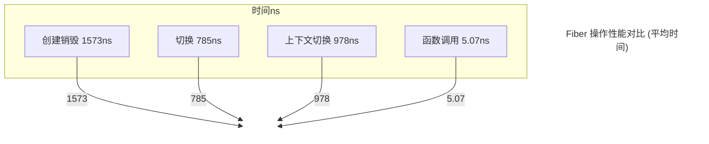
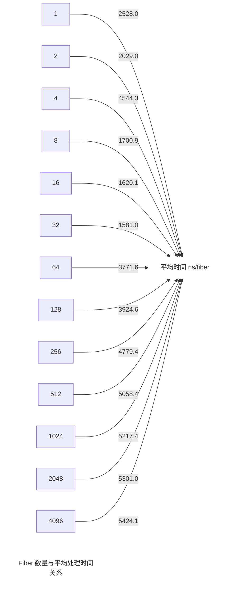

<!-- TOC -->
<!-- /TOC -->
# Fiber分析
基于fiber.h和fiber.cc的协程实现分析

**概述**

Fiber类是一个基于ucontext实现的N:1对称有栈协程。本分析中的所有测试均在单线程环境下进行。（撰写该文档时未接入调度器，未植入后台运行时）

**关键特性**
- 协程类型：N:1对称有栈协程
- 实现基础：使用ucontext库
- 线程模型：单线程多协程
- 内存管理：使用智能指针（std::shared_ptr）进行协程对象管理
- 状态管理：包含多个协程状态（INIT, HOLD, EXEC, TERM, READY, EXCEPT）
- 栈管理：支持自定义栈大小

## 状态流转图
```
                     创建
                      |
                      v
+----------------+  swapIn  +----------------+
|     INIT       | -------> |     READY      |
+----------------+          +----------------+
        |                          |
        |                          | call() / swapIn()
        |                          v
        |                  +----------------+
        |                  |     EXEC       |
        |                  +----------------+
        |                    |     |     |     |
        |     YieldToReady() |     |     |     | back()
        |                    |     |     |     |
        |                    v     |     v     |
        |            +----------------+  |     |
        |            |     READY      |  |     |
        |            +----------------+  |     |
        |                    ^           |     |
        |                    |           |     |
        |                    |           v     |
        |            +----------------+        |
        |            |     HOLD       |        |
        |            +----------------+        |
        |                    ^                 |
        |                    |                 |
        | swapOut()          | swapIn()        |
        |                    |                 |
        |            +----------------+        |
        |            |   主协程/调度器  | <------+
        |            +----------------+
        |                    |
        |                    | MainFunc() / CallerMainFunc()
        |                    v
        |            +----------------+
        |            |     EXEC       |
        |            +----------------+
        |                    |
        |              异常发生或执行完毕
        |                    |
        |                    v
        |            +----------------+
        +----------> |   TERM/EXCEPT  |
                     +----------------+
                             |
                             | reset()
                             v
                     +----------------+
                     |     INIT       |
                     +----------------+
```
## 状态说明
1.**INIT**（初始状态）
- 协程创建后的初始状态
- 可通过 swapIn() 进入 READY 状态

2.**READY**（就绪状态）
- 从 INIT 状态通过 swapIn() 进入
- 从 EXEC 状态通过 YieldToReady() 返回
- 等待被调度器选中执行
  
3.**EXEC**（执行状态）
- 通过 call() 或 swapIn() 从 READY 进入
- 协程实际运行的状态
- 可能因 YieldToReady()、YieldToHold() 或执行完毕而退出

4.**HOLD**（暂停状态）
- 通过 YieldToHold() 从 EXEC 进入
- 可通过 swapIn() 重新激活回到 READY 状态

5.**TERM**（终止状态）
- 协程正常执行完毕后进入
- 可通过 reset() 重置回 INIT 状态

6.**EXCEPT**（异常状态）
- 协程执行过程中发生未捕获异常时进入
- 可通过 reset() 重置回 INIT 状态

## 核心操作
- swapIn(): 将协程切换到运行状态（READY -> EXEC）
- swapOut(): 将协程切换到后台，控制权回到主线程
- call(): 从主协程调用指定协程（类似于 swapIn）
- YieldToReady(): 将当前协程置于 READY 状态并切出
- YieldToHold(): 将当前协程置于 HOLD 状态并切出
- reset(): 重置协程状态，准备重新使用
- back(): 从当前执行的协程返回到主协程（用于调度器集成）

## 主要函数
- MainFunc(): 普通协程的入口函数
- CallerMainFunc(): 使用 use_caller 方式创建的协程的入口函数

## 执行流程
- 创建协程（INIT 状态）
- 通过 swapIn() 或 call() 使协程进入 READY 状态
- 调度器选择 READY 状态的协程执行，进入 EXEC 状态
- 执行 MainFunc() 或 CallerMainFunc()
- 协程可能多次让出执行权（YieldToReady()、YieldToHold() 或 swapOut()）
- 协程可通过 back() 方法直接返回到主协程
- 主函数执行完毕，协程进入 TERM 状态

## 异常处理
- 在 MainFunc() 或 CallerMainFunc() 执行过程中，未捕获的异常会导致协程进入 EXCEPT 状态

## 重置机制
- TERM 或 EXCEPT 状态的协程可通过 reset() 方法重置回 INIT 状态，实现协程复用

# Fiber 性能测试结果分析

## 测试环境

- CPU: 64 核心，3737.89 MHz
- L1 数据缓存: 32 KiB (x32)
- L1 指令缓存: 32 KiB (x32)
- L2 统一缓存: 512 KiB (x32)
- L3 统一缓存: 32768 KiB (x8)
注意：CPU 缩放已启用，可能会影响基准测试的实时测量结果。

## 测试结果概览

| 测试项 | 时间 (ns) | CPU 时间 (ns) | 迭代次数 | 平均时间 (ns) |
|--------|-----------|---------------|----------|---------------|
| BM_FiberCreateDestroy | 1573 | 1573 | 444306 | 1573 |
| BM_FiberSwitch | 1570 | 1570 | 445850 | 785 |
| BM_FunctionCall | 5.07 | 5.07 | 137797717 | 5.07 |
| BM_FiberContextSwitch | 978 | 978 | 715538 | 978 |

注：BM_FiberSwitch 的平均时间是 1570/2 = 785 ns，因为每次迭代包含两次切换。

## Fiber 内存使用测试结果（包含平均时间）

| Fiber 数量 | 时间 (ns) | CPU 时间 (ns) | 每秒处理数 | 平均时间 (ns/fiber) |
|------------|-----------|---------------|------------|---------------------|
| 1 | 2528 | 2527 | 395,736 | 2528.0 |
| 2 | 4058 | 4058 | 492,903 | 2029.0 |
| 4 | 18177 | 18081 | 221,232 | 4544.3 |
| 8 | 13607 | 13614 | 587,622 | 1700.9 |
| 16 | 25922 | 25932 | 616,998 | 1620.1 |
| 32 | 50593 | 50598 | 632,430 | 1581.0 |
| 64 | 241382 | 241351 | 265,174 | 3771.6 |
| 128 | 502353 | 502428 | 254,763 | 3924.6 |
| 256 | 1223538 | 1223611 | 209,217 | 4779.4 |
| 512 | 2589887 | 2589753 | 197,702 | 5058.4 |
| 1024 | 5342608 | 5342392 | 191,674 | 5217.4 |
| 2048 | 10856488 | 10854382 | 188,680 | 5301.0 |
| 4096 | 22217112 | 22216324 | 184,369 | 5424.1 |

## 图表分析

### 1. Fiber 操作性能对比




观察：
- Fiber 的创建销毁操作平均耗时最长，为 1573 ns。
- 单次 Fiber 切换平均耗时为 785 ns，比创建销毁快。
- 上下文切换平均耗时为 978 ns，介于创建销毁和单次切换之间。
- 普通函数调用仍然最快，仅需 5.07 ns。

### 2. Fiber 内存使用性能（平均时间）



## 关键发现与洞察
1. 创建与销毁开销：Fiber 的创建和销毁操作（1573 ns）比单次切换（785 ns）耗时更多，说明应尽可能复用 Fiber 以提高性能。

2. 切换效率：Fiber 切换（785 ns）比上下文切换（978 ns）更快，展示了 Fiber 在轻量级并发方面的优势。

3. 函数调用基准：普通函数调用（5.07 ns）仍然是最快的操作，这强调了 Fiber 主要用于并发场景，而不是替代所有函数调用。

4. Fiber 数量与性能关系：
- 16-32 个 Fiber 时达到最佳平均性能（约 1600 ns/fiber）。
- Fiber 数量增加到 64 及以上时，平均处理时间显著增加，可能是由于缓存效应和调度开销。

5. 异常值分析：4 个 Fiber 时出现性能异常（4544.3 ns/fiber），可能与 CPU 缓存行大小或特定的调度策略有关，需要进一步调查。（TODO）

## 优化建议
1. Fiber 池化：实现 Fiber 对象池，减少创建和销毁操作，提高资源利用效率。（TODO）

2. 切换优化：进一步优化 Fiber 切换逻辑，因为这是最频繁的操作之一。(TOOD)

3. 并发度调整：在实际应用中，根据负载特性调整并发的 Fiber 数量，寻找性能与资源使用的最佳平衡点。

4. 内存布局：考虑 Fiber 对象的内存布局，优化缓存利用率，特别是在大量 Fiber 并发时。

5. 调度策略：实现智能调度策略，根据负载动态调整活跃 Fiber 数量，避免过多 Fiber 导致的性能下降。

6. 监控与分析：在生产环境中实现 Fiber 性能监控，收集实时数据以指导进一步优化。

7. 异常处理优化：优化异常处理机制，减少进入 EXCEPT 状态的频率，提高系统稳定性。